# Лабораторная работа "Вейвлет-преобразования" по предмету Кодирование информации
###### Работу выполнил студент 4-го курса МФТИ ФРТК Юрко Максим, Б01-905

## Цель работы
Научиться использовать вейвлет-разложение при обработке изображений. Закрепление понимания свойств преобразования. Практическое использование вейвлет-преобразования для фильтрации сигналов.

## Используемое оборудование и библиотеки
Для выполнения лабораторной работы я взял свою аватарку из социальных сетей. Лабораторная работа написана на языке программирования Python с использованием библиотек:
- opencv (cv2) - для обработки изображения
- PyWavelets (pywt) - для работы с вейвлет-преобразованиями
- numpy - для работы с числовыми данными
- matplotlib - для построения графиков

## Выполнение
#### Задание 1
С помощью установленной библиотеки opencv я прочитал изображение, привел его к размеру 512x512 и перемел к серой гамме с помощью команд:
```python
img = cv2.imread('src/image.jpg')
img = cv2.resize(img, (512, 512))
img = cv2.cvtColor(img, cv2.COLOR_BGR2GRAY)
```
где `src/image.jpg` путь к взятой мной картинке.

Для проверки я вывел инфорамцию о каждом кадре закодированного видео, по которой можно удостовериться, что фрагмент закодирован так, как нам было нужно (I и P -кадры чередуются).

Далее, мной были реализованы вейвлет-преобразования Хаара и Добеши 2-го порядка, до 4-го уровня. Занулив высокочастотные компоненты и собрав матрицу горизонтальных, вертикальных и диагональных компонент, для каждого из уровней и вейвлет-преобразования, получил следующие изображения:


На рисунке выше можно видеть выделенные границы: сверху справа - горизонтальные, снизу слева - вертикальные и снизу справа - диагональные (их видно не так хорошо, как остальные, т.к. на изображении их было не так много).

Также для каждого из вейвлетов было восстановлено изображение

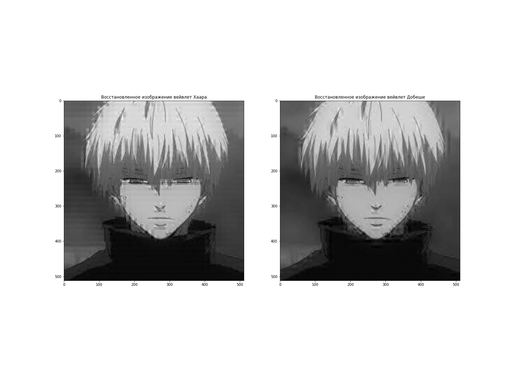

На рисунке можно увидеть, что при использовании вайвлета Хаара, восстановленное изображение более «пиксельное», чем при использовании вейвлета Добеши.

В конце выполнения первого задания, мною были сравнены восстановленные изображения (использую вейвлет Хаара и Добеши) с классической низкочастотной фильтрацией.

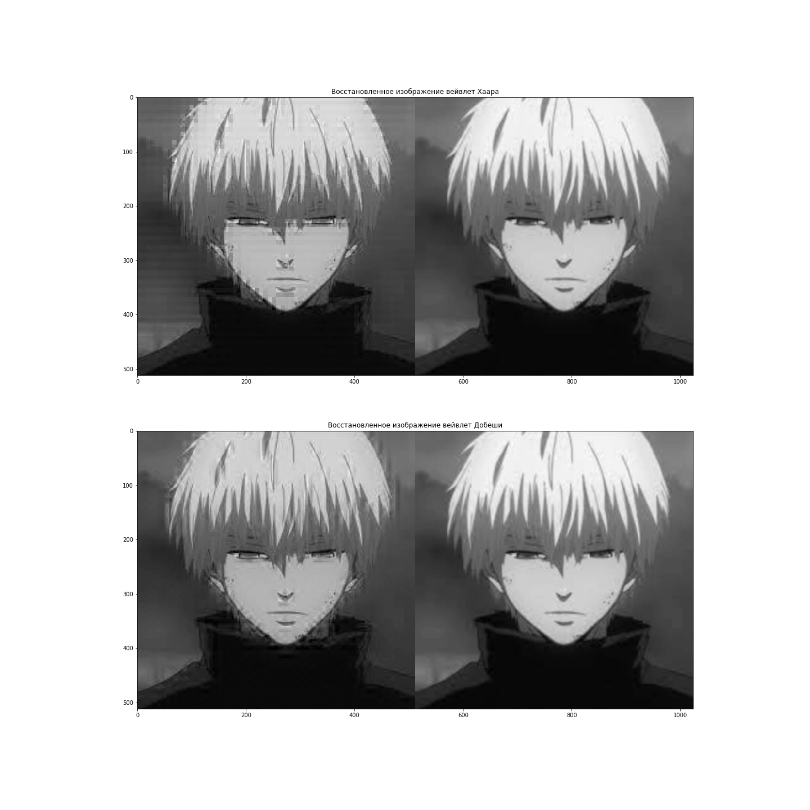

Из анализа получившихся картинок, можно сделать вывод, что при использовании вейвлета Добеши результат больше похож на использование классической фильтрации.


#### Задание 2
Для выполнения второго задания мной были написаны некоторые, необходимые для работы функции:

- функция нормировки
```python
def normalization(x):
    return (x - np.min(x)) / (np.max(x) - np.min(x))
```

- функция фильтрации
```python
def set_threshold(x, threshold):
    copy = x.copy()
    copy = normalization(copy)
    x[copy < threshold] = np.mean(x)
    return x
```

- функция добавления гауссовского шума на изображение
```python
def add_gaussian_noise(image, mean, stddev):
    noise = np.random.normal(mean, stddev, image.shape)
    return np.clip((image.astype(np.float32) + noise), 0, 255).astype(np.uint8)
```

- функция вычисления значения стандартного отклонения (далее - `СКО`) между исходным и восстановленным изображением
```python
def calculate_sko(image):
    # Список для хранения значений СКО
    sko_values = []
    
    for wavelet in wavelets:
        sko_wavelet = []
    
    ...
```

- функция вычисления значения стандартного отклонения между исходным незашумленным изображением и восстановленным изображением
```python
# Вычисление значения стандартного отклонения между исходным незашумленным изображением и восстановленным изображением
def calculate_compare_sko(image, original_img):
    # Список для хранения значений СКО
    sko_values = []
    
    for wavelet in wavelets:
        sko_wavelet = []
    
        for threshold in thresholds:
        
    ...
```

С помощью функции добавления гауссовского шума на изображение, я получил следующий результат, задав разный уровень зашумления (низкий, средний и высокий)

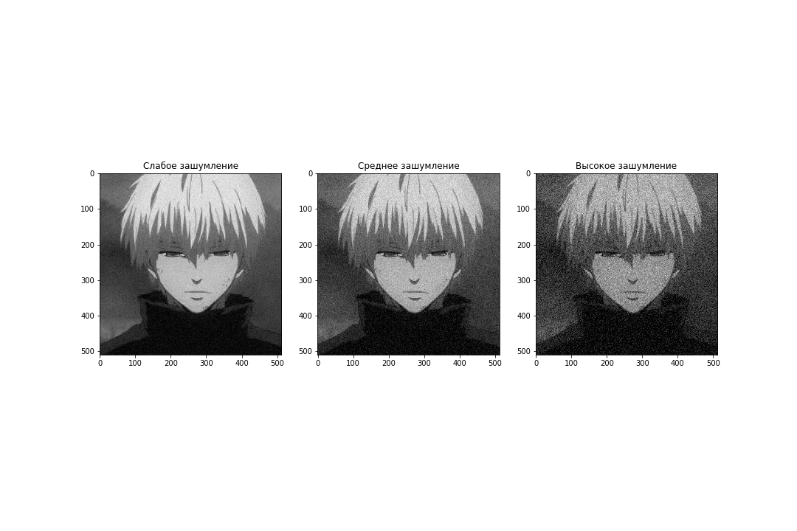

Далее, я построил для каждого уровня шума график зависимости СКО

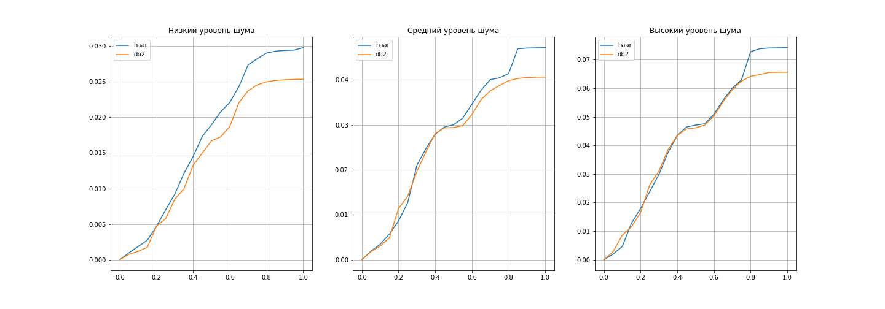

После, с помощью функции `calculate_compare_sko(image, original_img)`, я вывел графики СКО между исходным незашумленным изображением и восстановленным изображением для каждого уровня шума.

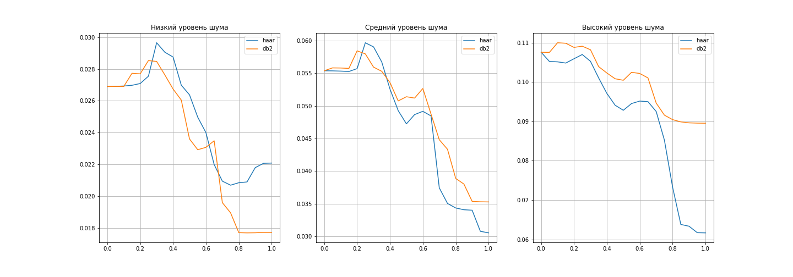

По графикам я выбрал значения, при которых СКО достигает наименьшего значения и вывел наилучший визуальный результат фильтрации и восстановления для каждого уровня шума. И получил:


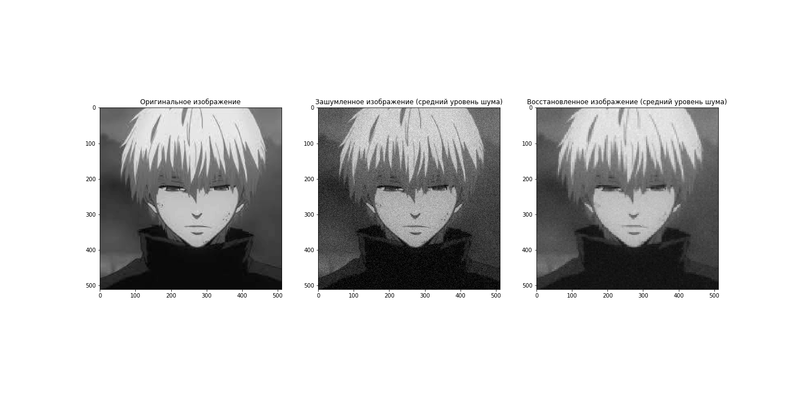

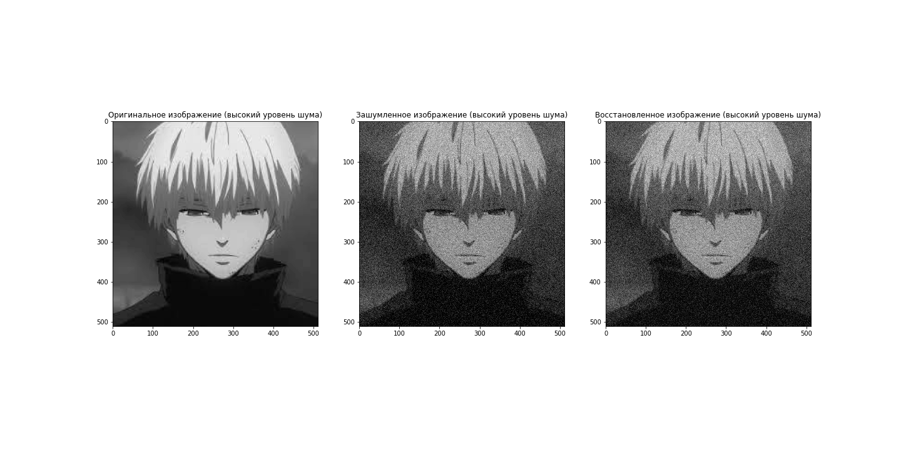

Для среднего шума фильтрация сгладила тон изображения, немного убрала контрастность и убрала некоторое количество выделяющихся шумов, из-за чего он стал менее заметен. Для высокого уровня шума результат оказался неплохим, шум стал заметно слабее виден.

#### Задание 3
Для выполнения этого задания мной были реализованы функции:

- нормировки
```python
def normalization(x):
    return (x - np.min(x)) / (np.max(x) - np.min(x))
```

- фильтрации
```python
def set_threshold(x, threshold):
    copy = x.copy()
    copy = normalization(copy)
    x[copy > threshold] = np.mean(x)
    return x
```

- добавления «salt and papper» шума 
```python
def add_salt_and_pepper_noise(image, salt_prob, pepper_prob):
    noised_image = image.copy()
    rows, cols = noised_image.shape
    salt_amount = int(rows * cols * salt_prob)
    pepper_amount = int(rows * cols * pepper_prob)
    
    # Добавляем salt (белые точки)
    salt_coords = [np.random.randint(0, i - 1, salt_amount) for i in noised_image.shape]
    noised_image[salt_coords[0], salt_coords[1]] = 255

    # Добавляем pepper (черные точки)
    pepper_coords = [np.random.randint(0, i - 1, pepper_amount) for i in noised_image.shape]
    noised_image[pepper_coords[0], pepper_coords[1]] = 0
    
    return noised_image
```

После добавления шума трех уровней на исходное изображение (рис. ниже)

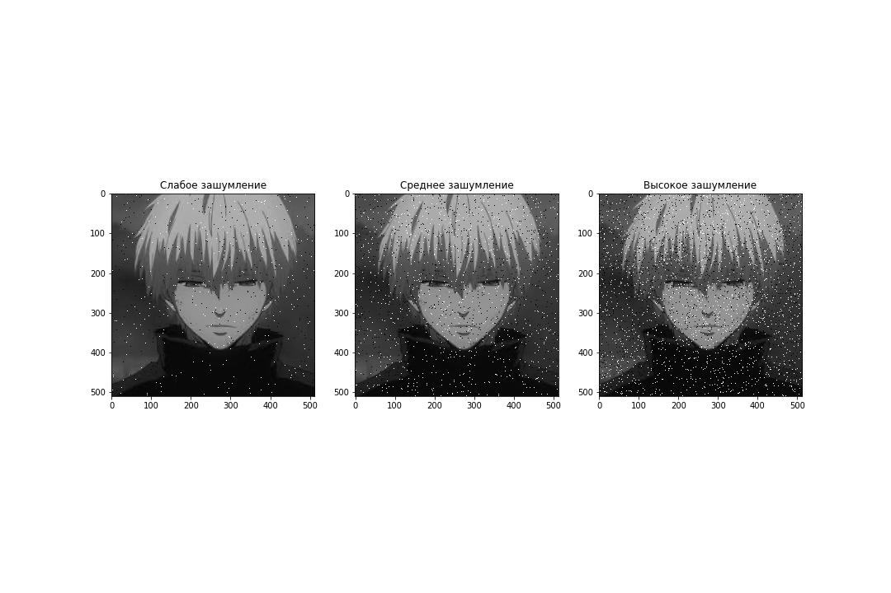

я вывел графики зависимости СКО для каждого уровня шума и разложенными-отфильтрованными их копиями для разных вейвлетов и уровней трешхолда.

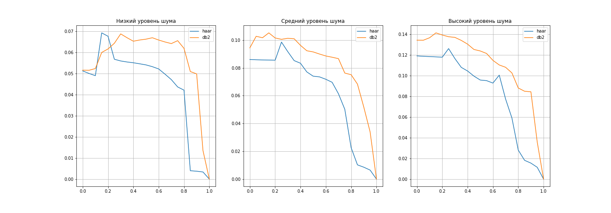

Как и ожидалось, графики СКО для низкого уровня шума проходят ниже, чем для среднего и высокого. Далее я вывел графики сравнения с исходным незашумленным изображением.

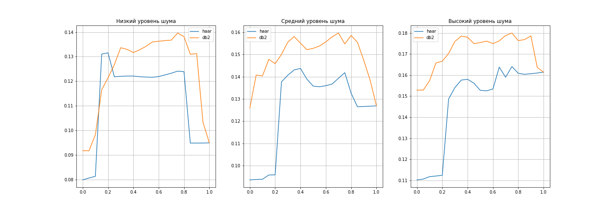

В данном случае точки минимумов у графиков отличны от threshold = 1, причем у всех уровней шума СКО сходится при threshold -> 1 к определенному значению, не максимальному и не минимальному. Далее, аналогично предыдущему пункту, я сделал наилучшие визуализации для каждого уровня шума.

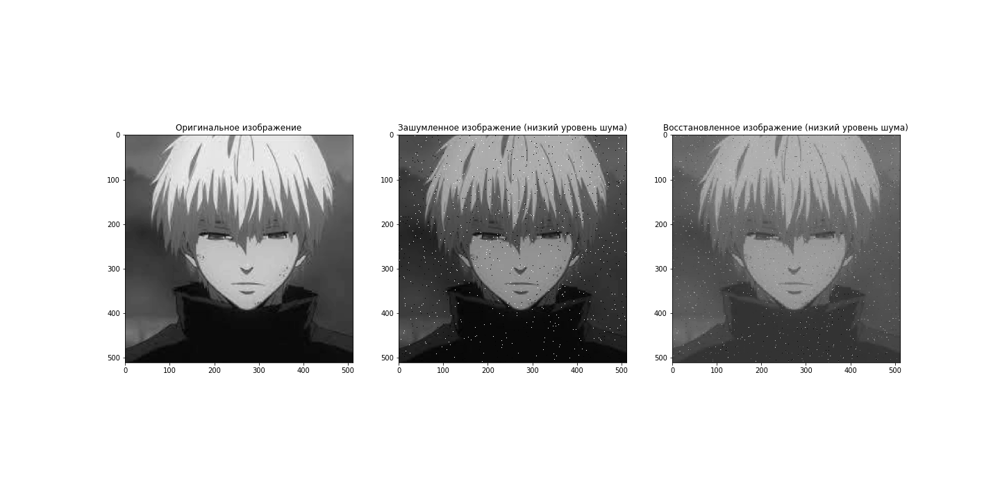


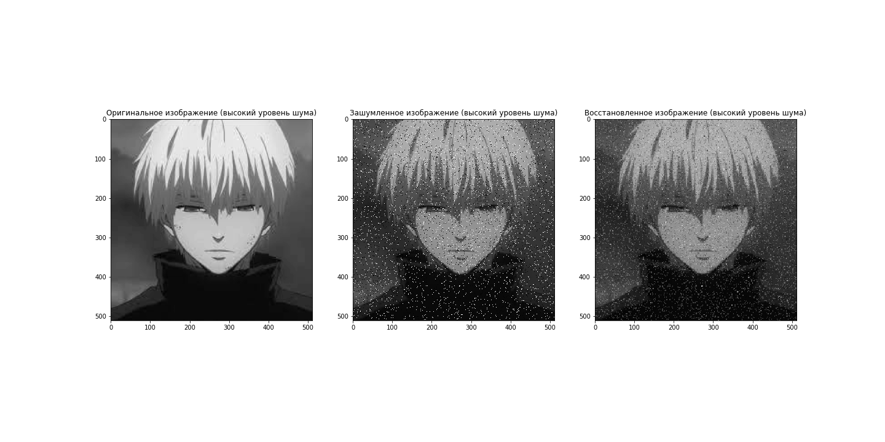

Для низкого уровня шума видим, что в результате фильтрации размазались черные точки, а белые подтерлись и стали менее заметными. Для среднего уровня результат похож на случай с низким уровнем шума: в областях с черными и белыми точками изображение немного размазывается, тон этих зашумленных участков приближается к серому.

## Выводы
В рамках выполнения этой лабораторной работы я ознакомился и научился работать с вейвлет-преобразованиями Хаара и Добеши второго порядка, а также проводить несколько уровней вейвлет-разложений и фильтрацию по разным уровням threshold.

Оказалось, что для фильтрации обычного гауссова шума всех уровней больше подошел вейвлет Хаара. Хотя в случае высокого уровня шума оказалось лучше всего использовать уровень трешхолда, близкий к 0 (то есть фильтровать почти все коэффициенты 1-го уровня вейвлет разложения).

Для фильтрации шума типа «salt and papper» также лучше себя показал вейвлет Хаара. Свойства уровня threshold оказались отличными от случая гауссова шума, то есть при высоком шуме наилучший для визуализации уровень трешхолда оказался равным нулю, а для низкого и среднего - около нуля.
