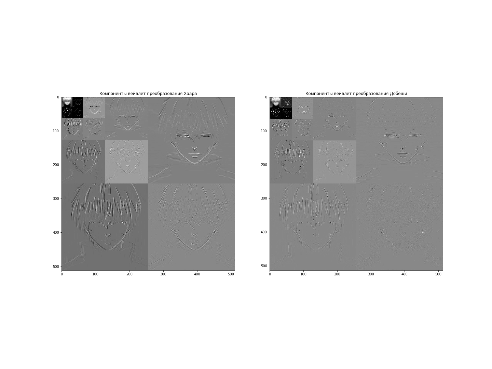

# Лабораторная работа "Вейвлет-преобразования" по предмету Кодирование информации
###### Работу выполнил студент 4-го курса МФТИ ФРТК Юрко Максим, Б01-905

## Цель работы
Научиться использовать вейвлет-разложение при обработке изображений. Закрепление понимания свойств преобразования. Практическое использование вейвлет-преобразования для фильтрации сигналов.

## Используемое оборудование и библиотеки
Для выполнения лабораторной работы я взял свою аватарку из социальных сетей. Лабораторная работа написана на языке программирования Python с использованием библиотек:
- opencv (cv2) - для обработки изображения
- PyWavelets (pywt) - для работы с вейвлет-преобразованиями
- numpy - для работы с числовыми данными
- matplotlib - для построения графиков

## Выполнение
#### Задание 1
С помощью установленной библиотеки opencv я прочитал изображение, привел его к размеру 512x512 и перемел к серой гамме с помощью команд:
```python
img = cv2.imread('src/image.jpg')
img = cv2.resize(img, (512, 512))
img = cv2.cvtColor(img, cv2.COLOR_BGR2GRAY)
```
где `src/image.jpg` путь к взятой мной картинке.

Для проверки я вывел инфорамцию о каждом кадре закодированного видео, по которой можно удостовериться, что фрагмент закодирован так, как нам было нужно (I и P -кадры чередуются).

Далее, мной были реализованы вейвлет-преобразования Хаара и Добеши 2-го порядка, до 4-го уровня. Занулив высокочастотные компоненты и собрав матрицу горизонтальных, вертикальных и диагональных компонент, для каждого из уровней и вейвлет-преобразования, получил следующие изображения:
<br>


#### Задание 2


#### Задание 3


#### Задание 4
Для оценки качества полученного видеоряда я использовал метрики SSIM, PSNR и размер файлов.
> Метрика `SSIM (Structural Similarity Index)` показывает степень структурной схожести между двумя изображениями. Она измеряет три аспекта изображения: яркость, контрастность и структуру, и дает оценку на основе этих факторов. SSIM принимает значения от 0 до 1, где 1 означает полное сходство между изображениями.

> Метрика `PSNR (Peak Signal-to-Noise Ratio)` показывает отношение максимального значения сигнала к квадрату среднеквадратической ошибки (MSE) между оригинальным и сжатым видео. Чем выше значение PSNR, тем лучше качество изображения или видео, потому что сжатый сигнал содержит меньше ошибок в сравнении с оригиналом.
<br>


Для обработки и вычислений всех необходимых параметров каждого кадра, я использовал библиотеку opencv.
Ниже приведена таблица с значениями метрик для каждого файла.

| Метрика\Файл | original.mp4 | task-1.mp4 | task-2.mp4 | task-3.mp4 |
|:------------:|:------------:|:----------:|:----------:|:----------:|
| SSIM         |    1.0000    |   0.9804   |   0.9814   |   0.9799   |
| PSNR         |              |   38.911   |   39.169   |   38.803   |
| Size         |    4.76 Mb   |   5.94 Mb  |   3.73 Mb  |   1.49 Mb  |

## Выводы
В рамках выполнения этой лабораторной работы я познакомился и научился работать с FFmpeg. Проанализировав получившиеся значения размеров файлов и метрик SSIM, PSNR, можно сделать вывод, что при кодировании видео с использованием предсказания
вперед максимум на четыре кадра имеет наилучшее качество и относительно небольшой размер файла, однако при кодировании видео с использованием только предсказаний только вперед и назад, размер выходного файла получается наименьшим. Это связано с тем,
что B-кадры могут быть восстановлены из предыдущих и следующих кадров, т.е. могут использовать больше информации для сжатия видео, что приводит к меньшему размеру файла. Но если последующие кадры содержат много движения, данный метод кодирования может привести к ухудшению качества видео, что мы и наблюдаем.

Также можно заметить, что файл, закодированный только с использованием предсказания вперед на один кадр, имеет наихудшее качество воспроизведения. Это связано с тем, что он не использует дополнительную информацию из других кадров при кодировании. Файл, закодированный данным методом, имеет наибольший размер из-за того, что при использовании только P-кадров в качестве ссылочных кадров в кадре используется большое количество предиктивной информации, которая увеличивает размер файла.
